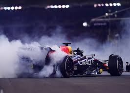

#### Purpose
```{margin} Want to learn more?
Checkout Jasper's awesome [Medium](https://medium.com/towards-formula-1-analysis) page for more F1 analysis
```
To compare and analyze the performance of Red Bull's two drivers in the last race of the F1 2022 season: Abu Dhabi. We are Race Engineers preparing debrief with team post-Abu Dhabi. Focus is on comparing how the two drivers performed relative to each other/competition. Part of the book will provide some background on F1 and how events such as Qualification work.

Structure:
1. Methodology discussion/reasoning 
2. Qualification
3. Race
4. Conclusion 




Flow for each notebook will be:

```python
import libraries

df = fastf1.access_data()

df.plot()

# provide insights from data/visuals

```

```{note}
In working through this project, I ran into issues with glue and Plotly figures. Doing some research, I found a [function](https://github.com/executablebooks/jupyter-book/issues/1815]) that overcame this issue. Here's the function:

```python
import panel as pn
pn.extension('plotly')

def gluePlotly(name,fig,**kwargs):
    """Wrap Plotly object with Panel and glue()"""
    return glue(name, pn.pane.Plotly(fig,**kwargs), display=False)
```

```{warning}
As a Max fan - this analysis is by no means objective
```

